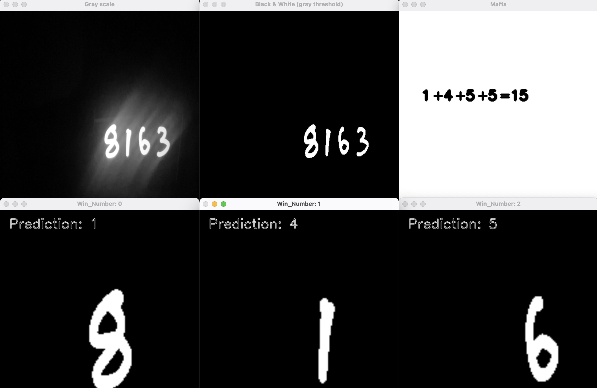

# Project Title

Simple overview of use/purpose.

## Description

An AI that's able to recognize the digits from 0 to 9. through your webcam. It's based on the MNIST dataset. It's a simple neural network with 1 hidden layers. It has 784 neurons. The activation function is ReLU. The optimizer is Adam. The loss function is categorical crossentropy. The accuracy is 98%.

## Getting Started

### Dependencies

* opencv-contrib-python 
* numpy
* tensorflow
* tensorflow_datasets
* imutils

### Installing

* gh repo clone TrakeLean/Main-Project-NUM_IMG_AI

### Executing program

There are two configurations when running the program. One is able to recognize more than two digits at the same time, but it has a major bug. The other one can only do two.

in cell 27 is where you choose between these two configurations.
```
temp_window = crop_shape(temp_window, zoom_ratio, 0, centercoords)
```
```
temp_window = zoom_at(temp_window, zoom_ratio, 0, centercoords)
```
The last one runs fine without any bugs, while the first one has a bug that makes the program crash.

the thing you have to be careful of when use the first configuration, is not creating any contours that has x or y values below the value in variable "init_zoom" in the function crop_shape. If you do, the program will crash.

Here's the crash boundaries for the first configuration, when the "init_zoom" is 170:


## Help

You have to run the program in a dark room for it to work properly. If you have a bright light source in the room, it will not work. You can use your phone to draw the numbers on while also turning up the brightness for the webcam to see it.

The program removes all the extra windows created while running when it doesn't see any contours, so if there are a lot of windows on your screen and you want to remove them, just put your thumb on the camera and it will remove all the windows.

To shut the program down you have to press "q" on your keyboard.

You also want to make sure that you're placing the number in the middle of the screen, so that the program can recognize it properly.


this is a problem that the first configuration fixed since it's able to zoom in on the number.

* Configuration 1:


* Configuration 2:

## Authors

* [@TrakeLean](https://github.com/TrakeLean)
* [@Snusemumrikken](https://github.com/Snusemumrikken)

## Acknowledgments

Inspiration, code snippets, etc.
* [awesome-readme](https://github.com/matiassingers/awesome-readme)
* [NeuralNine](https://www.youtube.com/watch?v=t0EzVCvQjGE)
* [NeuralNine](https://www.youtube.com/watch?v=bte8Er0QhDg)
* [freeCodeCamp.org](https://www.youtube.com/watch?v=oXlwWbU8l2o)
* [Stackoverflow](https://stackoverflow.com/)